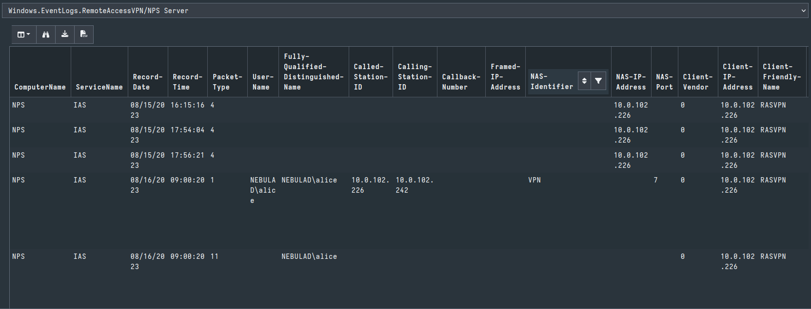
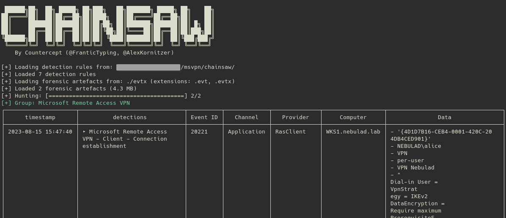

# Microsoft Remote Access VPN Forensic analysis

This repository contains resources related to the forensic analysis made on Microsoft Remote Access VPN and available on this blog post: https://www.synacktiv.com/publications/forensic-aspects-of-microsoft-remote-access-vpn.html. 
- a Velociraptor client artifact [Windows.EventLogs.RemoteAccessVPN.yaml](./velociraptor_client_artifact/Windows.EventLogs.RemoteAccessVPN.yaml)
- 7 chainsaw rules in the [microsoft_rasvpn_events](./chainsaw_rules/microsoft_rasvpn_events/) directory
- and a Python script to execute on the VPN server that allows to dump the RaAcctDb WID database in CSV files [csv_export_raacctdb.py](./csv_export_raacctdb/csv_export_raactdb.py)

## Velociraptor artifact

Import the [Velociraptor Artifact Exchange](https://docs.velociraptor.app/exchange/) pack or import [Windows.EventLogs.RemoteAccessVPN.yaml](./velociraptor_client_artifact/Windows.EventLogs.RemoteAccessVPN.yaml) from this repository.

- Summary of the artifact

- VPN Client logs
  

- VPN Server logs

- NPS Server logs

## Chainsaw rules

Specify in your chainsaw cli arguments the [microsoft_rasvpn_events](./chainsaw_rules/microsoft_rasvpn_events/) directory, or use the rules from chainsaw repository from PR TODO.

## Python script to export RaAcctDb database

To export the data stored by Remote access reporting feature in the WID RaAcctDb, you must:

1. Install Python3 in the Remote Access VPN server
2. Install pyodbc package: `pip install pyodbc`
3. Copy [csv_export_raacctdb.py](./csv_export_raacctdb/csv_export_raactdb.py) in a local directory
4. Create an output directory
5. Run the script: `python csv_export_raacctdb.py <out_dir>` (relative or absolute path are accepted)
6. A CSV file is created for each table

## Copyright

2023 - Théo Letailleur, Synacktiv

## License

The contents of this repository is available under [AGPL License](./LICENSE)

## Contact

- Théo Letailleur: theo.letailleur@synacktiv.com
- CSIRT Synacktiv: csirt@synacktiv.com

